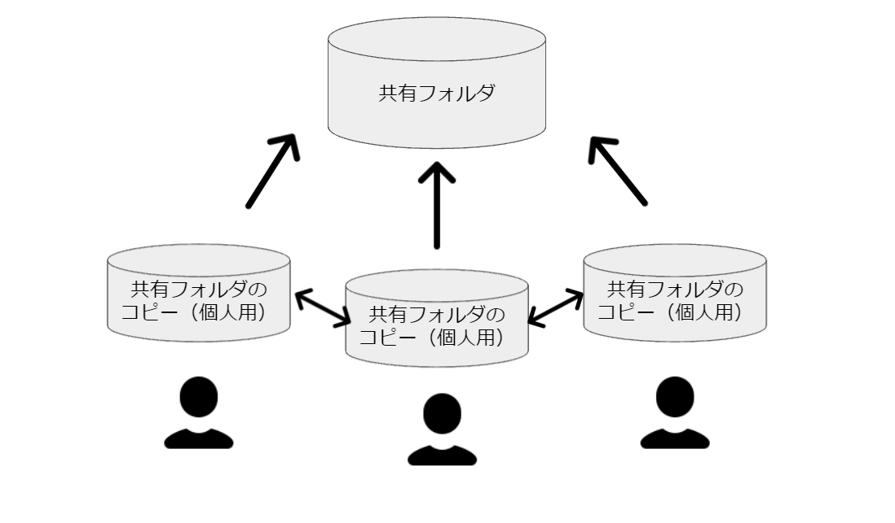
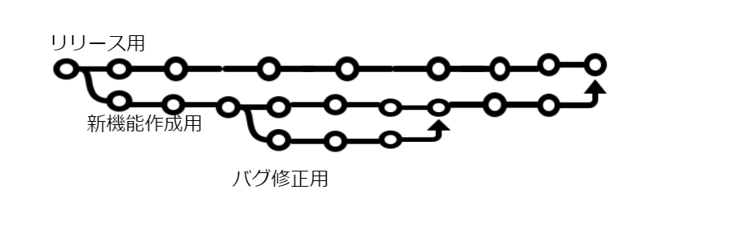

# Git 入門（基礎編）

[Git 入門（基礎編）](#git入門基礎編)

- [Git 入門（基礎編）](#git-入門基礎編)
  - [Git の基本](#git-の基本)
    - [なぜ Git？](#なぜ-git)
    - [バージョン管理とは](#バージョン管理とは)
    - [ブランチとは](#ブランチとは)
        - [絵にしてみると Part1](#絵にしてみると-part1)
        - [絵にしてみると Part2](#絵にしてみると-part2)
    - [基本的なコマンド](#基本的なコマンド)
      - [クローン](#クローン)
      - [ステージング](#ステージング)
      - [コミット](#コミット)
      - [プッシュ](#プッシュ)
      - [プル](#プル)
      - [マージ](#マージ)
    - [Github とは](#github-とは)
      - [Issue について](#issue-について)
      - [PullRequest について](#pullrequest-について)
  - [チームでの運用](#チームでの運用)
  - [参考資料](#参考資料)
-

## Git の基本

### なぜ Git？

### バージョン管理とは

-   作業用フォルダー
    -   卒論.pdf
    -   卒論(1).pdf
    -   卒論\_最新.pdf
    -   卒論\_修正版.pdf
    -   卒論\_最終稿.pdf

→ どれが最新なの？1 つ前の版は？3 つ前の版は？

-   作業用フォルダー
    -   卒論\_20211001.pdf
    -   卒論\_20211002.pdf
    -   卒論\_20211005.pdf

→ 変更履歴については分かりやすいが、新バージョンが出来るたびに容量が増えていく...

git をはじめとしたバージョン管理を利用することで

**履歴を辿れて容量も抑える、改ざんにも強い、複数人での作業もはかどります**



### ブランチとは

git を使う上での必須知識として、`branch`があります。

ブランチがあることによって、時系列の管理だけでなく、平行世界を作ることが出来ます。

[バージョン管理とは](#バージョン管理とは)を例にしてみると以下のようになります。

-   作業用フォルダー（文章）
    -   卒論.pdf
        -   卒論\_20211001
        -   卒論\_20211002
        -   卒論\_20211005
-   作業用フォルダー（図解あり）
    -   卒論.pdf
        -   卒論\_20211001
        -   卒論\_20211002
        -   卒論\_20211004
        -   卒論\_20211005
-   提出用フォルダー
    -   卒論.pdf
        -   卒論\_202109
        -   卒論\_202110

`branch`には枝という意味があり、絵で示してみるとこのようになります。

##### 絵にしてみると Part1

`作業用フォルダー（文章）`に`作業用フォルダー（図解あり）`が合流しています。つまり、文章のみだったファイルに図解部分だけを移行するという使い方ができます。


##### 絵にしてみると Part2

実際に開発チームで運用している状態を抜粋してみると以下のようなブランチになります。
全体像を絵にしてみるともっと複雑になりそうですが、慣れてくると管理がしやすくなります。



### 基本的なコマンド

Git の利用する上で、最低限覚えておかなければいけないことが、上述の`branch`のほかにもあります。

-   clone（クローン）
-   add（ステージング）
-   commit（コミット）
-   push（プッシュ）
-   マージ（マージ）

#### クローン

クローンとは、共有フォルダをローカル（自分の環境）にコピーすることです。また、Git では共有フォルダのことをリポジトリといいますので一緒に覚えておきましょう。

```git
git clone [https://git]
```

上記のコマンドでプロジェクトのリポジトリをクローンして、タスクを進めていきましょう。
以下では、自分の作業内容をリポジトリに反映するための一連の操作について説明していきます。

#### ステージング

ステージングでは、どの作業内容を反映させるかを選択することが出来ます。
作業の中で設定ファイルが出来上がったり、未確定のプログラムが出来たりします。
ステージングすることで、そういった邪魔なファイルを共有しないということが出来ます。
あくまで選択しているだけということをお忘れなく...

```
git add sample.txt
```

#### コミット

コミットでは、ステージングで選択した変更内容を保存することが出来ます。
コメントを残すことができ、**_どんなコミットなのかを後世に残します_**。
あくまで保存しているだけで、リポジトリには反映されていません。

```
git commit -m "sample.txtの変更"
```

#### プッシュ

プッシュをすることによってついに共有フォルダとしての機能を果たします。
いままでは全てローカル上での話でした。
プッシュを初めて他の人はどんな作業をしているのかを確認できます。
プッシュはローカルの変更を共有リポジトリに送り出す操作です。

```
git push
```

#### プル

先ほどプッシュをすることで他の人は作業内容を把握できると記述しましたが、プルという操作をしなければリポジトリは更新されていません。
プルは共有リポジトリにある内容を引っ張ってくる操作です。

```
git pull
```

#### マージ

### Github とは

#### Issue について

#### PullRequest について

## チームでの運用

## 参考資料

ミクシィ Git 研修

https://docs.google.com/presentation/d/1EwjQnoqzzYsijrMNEsWGAj54yfQlbr2mvuxrDtKl-Ww/edit#slide=id.gcda03b9aa0_1_3016
